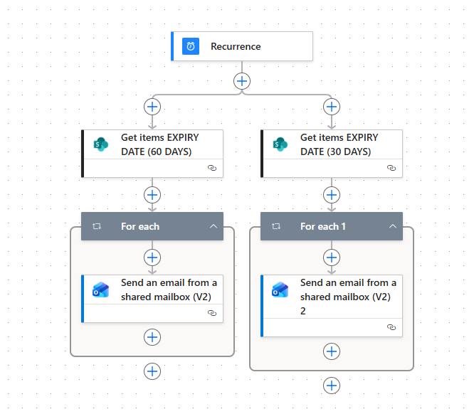

# Automated Client Document Expiry Reminder System

## **Problem/Challenge**
Managing client compliance documents involves tracking numerous expiration dates. Manually checking which documents are about to expire and sending individual reminders to clients is a tedious, high-effort task prone to oversight. Missing an expiry date can lead to legal complications or service interruptions. The challenge was to create a proactive system that monitors document dates and automatically notifies clients at specific intervals (60 days and 30 days) before their documents lapse.

## **Solution**
I developed a scheduled automation workflow using **Power Automate** that acts as a virtual compliance assistant. The flow runs on a daily recurrence, queries a **SharePoint** database for upcoming expiry dates, and sends personalized email notifications via a **Shared Mailbox**. This ensures clients have ample time to renew their documents without any manual intervention from the administrative team.

## **Technology**
* **Trigger:** `Recurrence` (Scheduled to run daily).
* **Logic & Control:** 
    * **Parallel Branching:** Executing two simultaneous tracks to check for different expiry thresholds (60 days vs. 30 days).
    * **OData Filtering:** Efficiently querying SharePoint items using filter queries to target only relevant expiry dates.
    * **Apply to Each (Loops):** Iterating through the list of identified clients to send individual reminders.
* **Integrations:** Microsoft SharePoint Online and Outlook (Shared Mailbox).

## **Workflow Overview**

1. **Daily Recurrence Trigger**
The flow is set to trigger automatically every morning, ensuring that no document expiry is missed.

2. **Parallel Expiry Monitoring**
To optimize efficiency, the system uses parallel branches to query the SharePoint Document Library:
    * **Branch A:** Identifies documents expiring in exactly **60 days**.
    * **Branch B:** Identifies documents expiring in exactly **30 days**.

3. **Data Retrieval (OData Filter)**
The flow uses the `Get items` action with a specific filter query. This ensures the system only processes records that match the target "Expiry Date," reducing unnecessary processing load.

4. **Automated Client Notification**
For every document found in the query, the flow enters an `Apply to each` loop:
    * It retrieves the client's contact information.
    * It sends a personalized, professional reminder email from a **Shared Mailbox**, informing the client of the specific document and the remaining time to renew.

## **Impact**
* **Proactive Compliance:** Reduced the risk of expired documents to near zero by giving clients a 2-month head start on renewals.
* **Operational Efficiency:** Saved hours of manual tracking and emailing per week for the compliance team.
* **Improved Client Experience:** Clients appreciate the professional, timely reminders, which helps them maintain their own regulatory standing.

**Author:** Rizky
