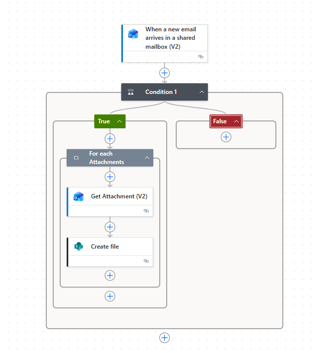

# Automated Signed Document Archiving from Outlook to SharePoint

## **Problem/Challenge**
After a tax document or contract is successfully signed via digital signature tools, the finalized file is typically sent back via email. Manually monitoring the inbox, downloading the signed PDF, and uploading it to the correct SharePoint folder is repetitive, time-consuming, and prone to oversight. The challenge was to create a "hands-off" archiving system that ensures every document signed with the subject "Completed" is instantly and accurately stored in the company’s centralized Document Library.

## **Solution**
I developed an automated archiving workflow using **Power Automate** that monitors a dedicated shared mailbox. The flow identifies successful signature notifications, extracts the attached PDF documents, and saves them directly to a specific **SharePoint Site Document Library**. This ensures that the legal and tax departments always have access to the latest signed versions without manual filing.

## **Technology**
* **Trigger:** `When a new email arrives in a shared mailbox (V2)` (Outlook).
* **Logic & Control:**
    * **Condition:** Subject-based filtering (Checking if the subject contains the keyword "Completed").
    * **Apply to Each (Loop):** Iterating through all email attachments to ensure multiple signed files are processed individually.
* **Integrations:** Microsoft Outlook (Shared Mailbox) and SharePoint Online.

## **Workflow Overview**

1. **Email Monitoring & Trigger**
The flow is specifically connected to a shared mailbox used for document CCs. It triggers instantly whenever a new email is received.

2. **Keyword Filtering (Condition)**
To prevent junk or irrelevant emails from being processed, the system checks the email subject. Only emails containing the word **"Completed"** (the standard status for finished digital signatures) proceed to the next step.

3. **Attachment Extraction**
Using the `For each` loop, the flow scans the email for attachments. It specifically targets the `Get Attachment` action to retrieve the raw content of the signed PDF.

4. **Automated SharePoint Archiving**
The flow uses the `Create file` action in SharePoint. It saves the document into a designated Document Library, preserving the original file name for easy searching and compliance.

## **Impact**
* **Instant Availability:** Signed documents are available in SharePoint within seconds of the signature completion.
* **100% Accuracy:** Eliminates the risk of missing a document or saving it to the wrong directory.
* **Centralized Repository:** Creates a single source of truth for all signed tax and legal files, facilitating easier audits and internal reviews.

**Author:** Rizky
