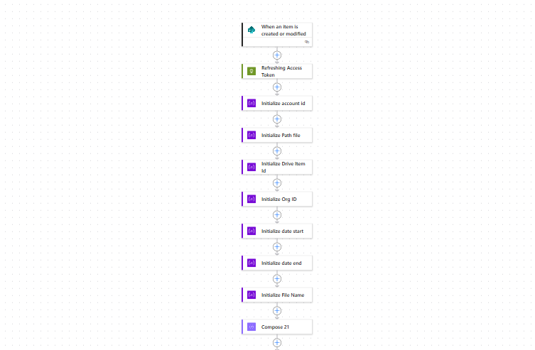
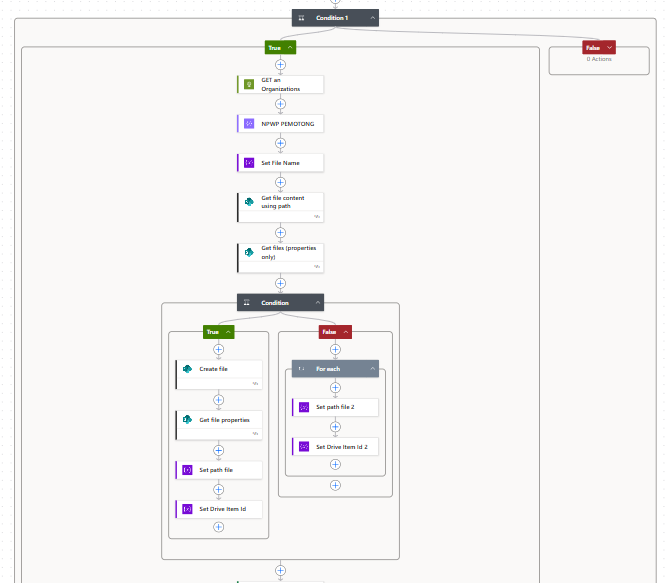
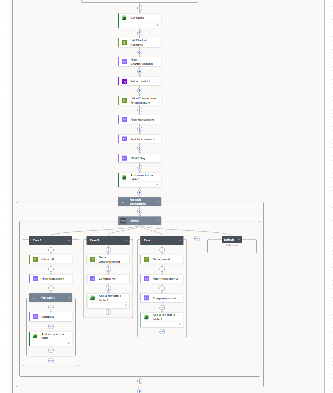

# Project: Automated Tax Integration (Zoho Books to Government Portal)

## **Problem/Challenge**
A Tax Accountant previously had to manually input data from the accounting system into the government website for tax reporting. This process was not only time-consuming but also highly susceptible to human error. The primary challenge was to automatically extract relevant transaction data and transform it into a compatible Excel format to be exported as .xml files (e-Faktur/e-Bupot) for direct upload to the tax portal.

## **Solution**
I designed and built an automation workflow using **Power Automate** that connects **Zoho Books** with the Microsoft 365 ecosystem. This solution automatically retrieves organizational data, the Chart of Accounts, and transaction details, then processes them using conditional logic to accurately populate tax report templates.

## **Technology**
* **ERP System:** Zoho Books (API Integration).
* **Triggers:** `When an item is created or modified` in SharePoint (serving as the execution controller).
* **Logic & Control:** * **Web Service (REST API):** Utilized HTTP actions for Refreshing Access Tokens to ensure a secure Zoho connection.
    * **Switch Case:** Segmented data processing logic based on Zoho transaction types (Bills, Vendor Payments, Journal).
    * **Variables:** Managed Account IDs, Org IDs, and dynamic file naming conventions.
* **Integrations:** Microsoft SharePoint, Excel Online (Business), and Power Automate.

## **Workflow Overview**
1.  **Authentication:** The flow begins by refreshing the Zoho Books access token to ensure the API session remains active and secure.

    

2.  **Organization Sync:** Retrieves organizational profile data and the Chart of Accounts from Zoho to ensure accurate tax account mapping.

3.  **Dynamic File Handling:** The system checks if the report file for the current period exists in SharePoint. If not, the flow creates a new file based on a master template.

    

4.  **Transaction Sorting (Switch Case):**
    * **Case Bills:** Fetches incoming bill data from Zoho Books.
    * **Case Vendor Payments:** Processes payment data to vendors.
    * **Case Journal:** Retrieves general journal adjustment entries.

5.  **Data Consolidation:** Each transaction row is inserted into an Excel table using the "Add a row into a table" action, formatted specifically for .xml conversion.

    

## **Impact**
* **Time Efficiency:** Reduced tax data preparation time from several hours to just a few minutes.
* **Data Integrity:** Ensured 100% synchronization between tax reporting and the records in Zoho Books.
* **Standardization:** Created a structured and repeatable reporting process every month without relying on manual input.

**Author:** Rizky
